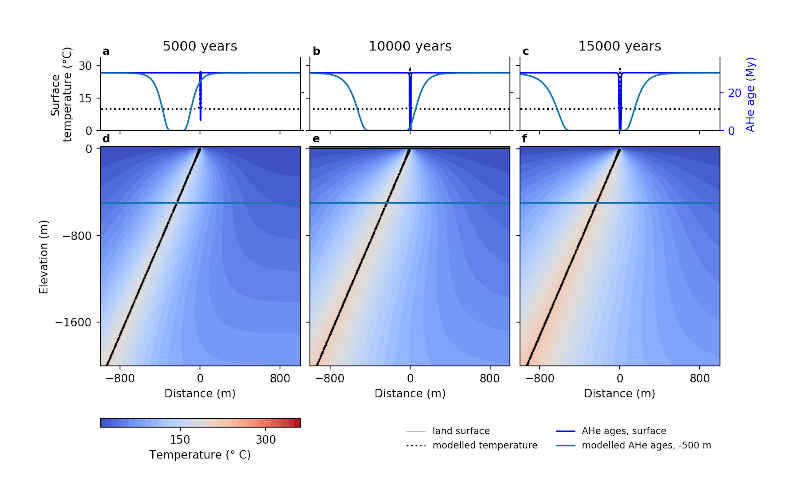

# Introduction

Beo is a model of heat flow in hot springs and hydrothermal systems. The model code uses the generic finite element code [escript](https://launchpad.net/escript-finley) to solve the advective and conductive heat flow equations in a 2D cross-section of the subsurface. The resulting temperature history is used to calculate the apatite (U-Th)/He (AHe) thermochronometer and can be compared to measured AHe ages. Beo supports automated model runs to explore which parameter values like fluid fluxes, fault geometry, age and duration of the hydrothermal activity best match thermochronometer data, spring temperature data or temperature records in nearby boreholes. 

 A description of the model background and two example case studies can be found in the journal Geoscientific Model Development ([Luijendijk 2019](https://doi.org/10.5194/gmd-12-4061-2019)). The model code was used to quantify episodic fluid flow in a fault zone in the Beowawe geyser field in the Basin and Range Province, which was published in a separate paper  in Geology ([Louis et al. 2019](https://pubs.geoscienceworld.org/gsa/geology/article/573168/Episodic-fluid-flow-in-an-active-fault)).




# Getting started

* Click the download link on the right for a zip file of the source code or clone the repository

* Install Escript

    - Get the code here: https://launchpad.net/escript-finley
    - An installation guide can be found here: http://esys.geocomp.uq.edu.au/docs
    - Note that the newer versions of escript support installation using Flatpak or Docker. These install sandboxed versions of escript that currently do not include the Python modules Scipy or Pandas. However, Beo uses these modules for interpolating variables and model-data comparison. Therefore the recommended way to install escript is to use the binary version in Debian/Ubuntu (``sudo apt-get install python-escript``) or to compile the source code.

* Unzip the beo source code 
* Navigate to the directory where you have installed escript and go to the subdirectory bin. If you used apt-get to install escript you can normally find escript in ``/usr/bin/``. Then run Beo by executing the following command from the command line:
	
````bash
./run-escript beo_dir/beo.py
````	

Where ``beo_dir`` is the directory where you have saved Beo.

Alternatively use the command 

````bash
./run-escript -e
````

This will show you three lines that define environment variables that your system needs to be able to find the location of escript. Add these lines to your .bashrc (Ubuntu linux) or profile file in your home directory. After adding these lines and logging out and in again, you can start beo by going to the directory where the beo code is located (so not to the escript/bin directory) and start beo.py like any regular python code:

````bash
python beo.py model_parameters/model_parameters.py
````

where ``model_parameters/model_parameters.py`` is a file containing all model parameters. An example file called ``model_parameters.py`` is located in the directory ``model_parameters``.


# Required modules

Beo requires the Python modules [Numpy](http://www.numpy.org/), [Pandas](https://pandas.pydata.org/), [Scipy](http://scipy.org/scipylib/index.html) and [Matplotlib](http://matplotlib.org/downloads.html). Note that the current version of escript and Beo still run on Python2.7. Beo will be ported to Python3 once a Python3 compatible version of escript is released.

An easy way to get a working version of python and these modules is to install a full Python environment like [Anaconda](https://www.anaconda.com/), [Canopy](https://www.enthought.com/products/canopy) or [pythonxy](https://code.google.com/p/pythonxy/wiki/Welcome).

Note that Beo includes an option to calculate apatite (U-Th)/He ages using the RDAAM model ([Flowers et al. 2009](https://www.sciencedirect.com/science/article/abs/pii/S001670370900043X)). The implementation of the RDAAM model uses a piece of Fortran code to speed up the model. To enable the RDAAM model you first need to compile the Fortran code using f2py, which is normally included with Numpy. See this [link](https://docs.scipy.org/doc/numpy/f2py/) for more information on f2py. To install the Fortran RDAAM module, navigate to the subdirectory lib and run the following command:

``f2py -c calculate_reduced_AFT_lengths.f90 -m calculate_reduced_AFT_lengths``

If all goes well there should now be a file called ``calculate_reduced_AFT_lengths.so`` in the subdirectory lib, which will be used by Beo to calculate radiation damage and the diffusivity of helium in apatites. Currently new updates are planned to convert the fortran code to python, which will remove this requirement.

Note that there are plans to port the fortran code to cPython to avoid this extra compilation step. Feel free to bug me if you have trouble compiling this or if you are interested in a Python only version. 

Beo was tested on Ubuntu 14.04, 16.04 and 18.04 


# Manual and publication

You can find a manual for beo in the subdirectory [manual](manual). The manual contains more background on the model, an explanation of how surface heat flow is modeled and a detailed list and explanation of the model parameters. More information on the model code can be found in [Luijendijk (2019)](https://doi.org/10.5194/gmd-12-4061-2019). See the bottom of this readme for the full reference for this paper. 

The paper shows model results for two example case studies: the Baden & Schinznach hot springs at the boundary of the Molasse Basin and the Jura, and the Brigerbad hot springs in the Rhone Valley in the Swiss Alps. These model runs can be reproduced by using one of the parameter files located in the directory [example_input_files](example_input_files).


# Model input & output

## Model input:

All model input parameters are contained in a single Python file. An example file can be found in [``model_parameters.py``](model_parameters/model_parameters.py) located in the directory [model_parameters](model_parameters). The class ``ModelParameters`` contains all parameters needed for a single model run. See the [manual](manual\beo_manual.pdf) for an explanation of the model parameters.


## Multiple model runs

Optionally you can start automated runs to test a range of parameter combinations. This is useful for automated sensitivity or uncertainty analysis. 

The model input file contains a class called ``ParameterRanges``. Any parameter value that is included in this class will be used as input for a single model run. All results will be stored and written to a comma separated (.csv) file names ``model_output/model_params_and_results_x_runs.csv``. 

You can include any model parameter in the automated runs. Simply copy a parameter from the ``ModelParameters`` class into the ``ParameterRanges`` class and add _s to the parameter name. For instance to test multiple values of the thermal gradient, add `thermal_gradient_s = [0.03, 0.04, 0.05]` to test the effect of geothermal gradients of 0.03, 0.04 and 0.05 C/m, respectively.

There are two options for running multiple model runs. The default is a sensitivity run. In each model run a single parameter will be changed, while all other parameters are kept constant at the default value specified in the ``ModelParameters`` class. Alternatively you can test all parameter combinations by changing `parameter_combinations = False` to `parameter_combinations = True`. Note that this will generate a lot of model runs, testing ten parameter values for two parameters each will generate 10*10 = 100 model runs, for three parameters this increase to a 1000 model runs, etc...


## Model output

* After each model run, the modeled temperature field and (U-Th)/He data are stored in the directory ``model_output`` as a .pck file, which can be read using Python's pickle module and which can be used by a separate script to make figures. 
* Beo saves a comma separated file containing the input parameters and a summary of the results for each model run and each timestep in the same directory.
* Beo also contains an option to save modeled temperature and advective flux to a VTK file, which can be used for visualization using software such as Paraview and Visit.


## Making figures

The script ``make_figures.py`` will make a single figure of the final temperature field for output files (with extension .pck) found in the directory ``model_output``. After running this script you will be prompted to select the output file that you would like a figure of. The file ``model_parameters/figure_params.py`` contains a number of parameters that control the figure, such as which timeslices to show, the min. and max. coordinates of the area to show, etc.. The resulting figure is saved as a .png file in the same directory as the model output file.


# Model Background

## Heat transport

Beo uses the generic finite element code escript to solve the heat flow equation and model conductive and advective heat transport in and around hydrothermal systems. Escript is designed to solve a single partial differential equation (PDE):

$$- \nabla (A \nabla u + B u ) + C \nabla u + D u = - \nabla X + Y$$

Where $u$ is the variable to be solved and A< B, C, D, X and Y are constants.

The heat flow equation used by Beo to model conductive and advective heat flow is given by:

$$\rho _b c_b \dfrac{\partial{T}} {\partial{t}}=\nabla \kappa \nabla T - \rho_{f} c_{p,f} \vec q \, \nabla T$$

In which $T$ is temperature (K), $t$ is time (sec), $c$ is heat capacity, $\rho$ is bulk density (${kg} m^{-3}$), $\kappa$ is thermal conductivity ($W m^{-1} s^{-1}$), $\phi$ is porosity, $\rho$ is density (kg m$^{-3}$), $c$ the heat capacity ($J kg^{-1} K^{-1}$) and $\vec v$ is the flow velocity vector (m s$^{-1}$). Subscripts $_b$, $_f$ and $_s$ denote properties of the bulk material, the fluid and the solid phase, respectively.


## Implicit form

Beo solves the implicit form of the heat flow equation by discretization of the derivative of $T$ over time:

$$\dfrac{\partial T}{\partial t} = \dfrac{T^{t+1} - T^t}{\Delta t}$$

Which when inserted into heat transport equation yields:

$$\rho _b c_b \dfrac{T^{t+1} - T^t}{\partial t} = \nabla \kappa \nabla T^{t+1} - \rho_{f} c_{p,f} \vec q \, \nabla T^{t+1}$$

which can be rearranged to:

$$- \nabla \Delta t \; \kappa \nabla T^{t+1} + \Delta t \, \phi  \rho_{f} c_{p,f} \vec{q} \nabla T^{t+1} + \rho_b c_b T^{t+1}  =  \rho_b c_b T^t$$

Casting the implicit heat transport equation into the escript PDE yields:

$$- \nabla \underbrace{ \Delta t \; \kappa}_A \nabla T^{t+1} + ( \underbrace{ \Delta t \rho_f c_f \vec{q}}_C ) \nabla T^{t+1} + \underbrace{\rho_b c_b}_D T^{t+1}  =  \underbrace{\rho_b c_b T^t}_Y$$


with the following values for the escript constants:

$u = T^{t+1}$

$A = \Delta t \; \kappa$

$C = \Delta t \rho_f c_f \vec{q}$

$D = \rho_b c_b$

$Y = \rho_b c_b T^t$


## Steady-state

The initial (undisturbed) background temperature is calculated by solving the steady-state heat flow equation, i.e. the heat flow equation with the term $\dfrac{\partial T}{\partial t}$ set to zero. For the initial temperatures the heat advection term is set to zero. In addition, there is also an option to subsequently model steady-state temperaratures with advective heat flow included. The steady-state heat flow equation solved in Beo is:

$$0 = \nabla \kappa \nabla T - \rho_{f} c_f \vec q \, \nabla T$$

$$- \nabla \kappa \nabla T + \rho_{f} c_f \vec{q} \nabla T  =  0$$


THe equation can be cast into the partial differential equation solvec by escript:

$$- \nabla (A \nabla u {B u }) + C \nabla u + {D u}  = {- \nabla X  + Y}$$

Which can be cast into the same form as the escript PDE:

$$- \nabla \underbrace{ \kappa}_A \nabla T + ( \underbrace{ \rho_f c_f \vec{q}}_C ) \nabla T  =  0$$

This yields the following parameters that Beo passes on to escript:

$u = T$

$A = \kappa$

$C = \rho_f c_f \vec{q}$


## Surface heat flux


Temperatures and heat flux at the land surface are controlled by latent and sensible heat flux. Wa approximate latent and sensible heat flux by assigning an artifically high value of thermal conductivity to the layer of air that overlies the land surface in the model domain. Following Bateni and Entekhabi @[2012] the sensible heat flux H (W m-2) at the land surface is given by:

$$H = \rho c / r_a (T_a - T_s)$$

Where $\rho$ is density (kg m^-3^), c is the specific heat of air (J kg^-1^ K^-1^), ra is the aerodynamic resistance (s m^-1^), T~a~ is the air temperature at a reference level and T~s~ is the surface temperature. Rewriting this to the conductive heat flow equation gives a value for the effective thermal conductivity (Ks) between the surface and the reference level z:

$$Ks = \rho c / r_a \Delta z$$

Where $\Delta$z is the difference between the surface and the reference level (m). Following Liu et al. [-@Liu2007] the aerodynamic resistance (ra) was set to a value of 80 s m^-1^ at a reference level of 1.8 m above the surface.  

Latent heat flux is given by [@Bateni2012]:

$$LE = \rho L / r_a (q_s - q_a)$$

where LE is the latent heat flux (W m^-2^), $\rho$ is the density of air (kg m^-3^), L is the specific latent heat of vaporisation (J kg^-1^), which is 334000 J kg^-1^, q~s~ is the saturated specific humidity at the surface temperature (kg kg^-1^), q~a~ is the humidity of the air (kg kg^-1^).

Rewriting this yield the heat transfer coefficient for latent heat flux:

$$Kl = \dfrac{\rho  L  \Delta z}{r_a}  \dfrac{q_s - q_a}{T_s - T_a}$$

The saturated specific humidity (q~s~) was calculated as [@Monteith1981]:

$$q_s = 0.622 e_s / P_a$$

where e~s~ is saturated air vapor pressure (Pa), P~a~ is surface air pressure (Pa). The saturated air vapor pressure was calculated using the Magnus equation [@Alduchov1996]:

$$e_s = 0.61094 \exp \left(\dfrac{17.625 T}{T + 243.04} \right)$$

Air pressure was assumed to be $1 \times 10^5$ Pa. 

The thermal conducivity assigned in the air layer is the sum of the heat transfer coefficient for latent heat flux (K~l~) and sensible heat flux (K~s~).


# Explanation of model parameters

The parameters that control Beo are stored in a python file called ``model_parameters.py`` in the class ModelParams.  The following section describes each of the model parameters.


## Data types

The parameters can be several python data types:

* boolean: this is a variable that can either be True or False. Used to control model options, such as ``create_mesh_fig = True``
* numbers: numbers can be either float (2.3) or integers (2).
* strings: text that is bracketed by '' or "", like this: "this is a string".
* lists: a list of numbers, strings (text) or a mixture of these. Example: ``phi0 = [0.45, 0.65, 0.45]``
* numpy arrays: arrays containing numbers. Similar to lists, but can only contain numbers. Arrays can either look like this: ``example_array = np.array([1, 2, 3])``, which means an array of three numbers 1, 2 and 3. Other options are creating a range of numbers: ``Ls = np.arange(2500, 52500, 2500)``, which creates an array called ``Ls`` that contains a range of numbers from 2500 to 52500, with steps of 2500. See the numpy documentation (https://docs.scipy.org/doc/numpy/user/basics.creation.html#arrays-creation and https://docs.scipy.org/doc/numpy/reference/routines.array-creation.html#routines-array-creation) for more options to create arrays.


## General parameters

* ``output_folder``: string. directory to store model output
* ``output_fn_adj``: string, name to add to output files generated by Beo = 'beowawe'
* ``steady_state``: boolean, option to choose a steady state (no changes over time) or transient model. note that regardless of this setting, the initial condition of transient model is the steady-state solution without any advection
* ``n_iterations_steady_state``: integer number. Number of iterations to use for the steady-state model. This is needed if the vapour correction or variable thermal conductivity of air are used. The steady-state model is then run several times, each time with updated temperatures to account for the boiling temperature and/or updated themral conductivity of the air layer to account for changes in surface temperature.
* ``vapour_correction``: boolean, use a function to keep the temperature below the maximum temperature in the vapour pressure curve. Note that this simply limits temperature and calculate where phase changes to vapour would happen, there is no vapour transport and the effect of phase changes on the energy/enthalpy budget are also not taken into account.
* `T_change_report`: list of numbers, size of area with temperature change to report compared to initial temperatures without advective fluid flow.


## Model dimensions and mesh parameters

* ``width``: number, width of the model domain on either side of the first fault (m)
* ``total_depth``: number, depth of the model domain (m)
* ``air_height``: number, height of the layer of air that is included in the model domain above the land surface (m). This layer is included for a more accurate simulation of land surface temperature as opposed to the traditional specified temperature or specified heat fluxes at the land boundary.
* ``z_fine``: number, depth to fine discretization near surface (m)
* ``cellsize``: number, default cellsize (m)
* ``cellsize_air``: number, cellsize in the air layer (m)
* ``cellsize_surface``: number, cellsize at surface layers (m)
* ``cellsize_fine``: number, fine cellsize near surface (up to depth = ``z_fine``) (m)
* ``cellsize_fault``: number, cellsize in fault zone (m)
* ``cellsize_base``: number, cellsize at the lower left and right corners of the model domain (m)
* ``use_mesh_with_buffer``: boolean, Use a buffer zone around fault with the same cell size as the fault. this is to reduce model instability.
* ``fault_buffer_zone``: number, size of the buffer zone around the fault (m)


## Exhumation parameters

* ``add_exhumation``: boolean, add exhumation or not. If set to True, the land surface is lowered over time to model erosion or exhumation. 
* ``exhumation_rate``: number, exhumation rate in m/yr
* ``exhumation_steps``: integer number, number of grid layers between initial and final surface level, the more layers, the more smooth and accurate the exhumation history, but this also slows the model down somewhat
* ``min_layer_thickness``: number, minimum layer thickness, if the exhumation steps result in surfaces that are less than the min thickness apart, the number of steps is reduced default value is 1.0 m, reduce this value if gmsh returns an error while creating the mesh


## Temperature boundary conditions

* ``air_temperature``: number, specified temperature at the top of the air layer (degrees C)
* ``thermal_gradient``: number, goethermal gradient (degrees C / m). new version: calculate bottom T using a fixed geothermal gradient./r
* ``basal_heat_flux``: number,  specified heat flux at the bottom of the model domain (W m-2). Set to None if T bnd is used


## Model layers

* ``layer_bottom``: list of numbers, elevation of layers either side of the fault. structured like this: [[depth layer 1 left, depth layer 1 right], [depth layer 2 left, depth layer 2 right], [depth layer 3 left, depth layer 3 right], etc...]. Layers are counted from bottom to top. leave depth of first layer at arbitrarily high value to make sure the entire model domain is covered. note that currently only 1 fault is taken into account.... example: ``layer_bottom = [[-20000.0, -20250.0], [-810.0, -1060.0],[-530.0, -780.0], [-440.0, -690.0], [-210.0, -460.0]]``


## Thermal parameters

Note that only thermal conductivity and porosity are varied between layers, the other parameters are constant. note K_air is not used if variable_K_air is set to True

* ``porosities``: list of numbers, porosity for each layer 
* ``K_solids``: list of numbers, thermal conductivity of the solid matrix for each layer (W m-1 K-1)
* ``K_air``: number, thermal conductivity of air (W m-1 K-1)
* ``K_water``: number, thermal conductivity of pore water (W m-1 K-1)
* ``rho_air`` : number, density of air (kg m-3)
* ``rho_f``: number, density of pore water (kg m-3)
* ``rho_s`` : number, density of the solid matrix (kg m-3)
* ``c_air``: number, heat capacity of air (J kg K-1)
* ``c_f``: number, heat capacity of pore water (J kg K-1)
* ``c_s``: number, heat capacity of the solid matrix (J kg K-1)
* ``variable_K_air``: boolean, option to use a fixed thermal conductivity for air or to use a variable thermal conductivity that depends on the surface temperature and that is used to approximate the actual sensible and latent heat flux at the land surface.
* ``ra``: number, aerodynamic resistance, see Liu et al. [-@Liu2007]
* ``dz``: number, measurement height for aerodynamic resistance (m)


## Timesteps and output

* ``N_outputs``: list of numbers, number of steps at which output files are generated. this is not used when exhumation > 0, in this case output is generated once each new surface level is reached. the number of surfaces is controlled by the ``exhumation_steps`` parameter
* ``dt``: number, size of a single timestep (sec)
* ``durations``: list of numbers, duration of each timestep slice (sec). Note that you can define one or more different timeslices, for instance to first model 500 years of heating and then 1000 years of recovery by setting ``durations = [500.0, 1000.0]``. You can define different fluid fluxes in faults or horizontal aquifers in the parameters ``fault_fluxes`` or ``aquifer_fluxes`` below.
* ``repeat_timeslices``: integer, number of times the durations, fault_fluxes and aquifer_fluxes are repeated. For instance if you specifiy two timeslices, with a duration of 1000 and 10000 years, with a hydrothermal flux in the first period and no flux in the second period, specifying ``repeat_timeslices = 10`` will repeat this sequence of episodic heating ten times.
* ``target_zs``: list of numbers,  target depth slices for calculating temperature and U-Th/He. In case of exhumation, this values is overridden and set equal to each exhumation step layer. In this way one can track the AHe response to each layer that comes to the surface in a longer time period. Note, values should go from low/bottom to high/top
* ``T_change_report``: list of numbers or array. Temperature change to report for each depth slice. Ie. when choosing for instance ``[10, 20]`` the model code will report the area where the modeled temperature is 10 and 20 degrees higher than the initial temperature for each timestep.


## Fault parameters

Beo simulates advective heat transport in faults. Note that beo does not model actual fluid flow, ie it does not solve Darcy's law or include permeability or such. Fluid flow is simply a fixed advective flux that is prescribed by the user.

* ``fault_xs``: list of numbers, x location of fault (m):
* ``fault_widths`` : list of numbers, width of the fault zone (m)
* ``fault_angles`` : list of numbers, angle of the fault zone (degrees).
* ``fault_bottoms``: list of numbers, elevation of bottom of fault (m)
* ``fault_segments``: list of numbers, different segments of the fault, list of the top bnd of each segments starting from the bottom, nested list: [[segment_top1_fault1, segment_top2_fault1], [segment_top1_fault2, segment_top2_fault2], etc...]. This is used to be able to assign a different fluid flux to different parts of a single fault (for instance below and above a connected aquifer)
* ``fault_fluxes``, list of numbers, fluid advection rates in faults (m2/sec). This is a nested list that is structured as follows: [[[fault1_segment1_t1, fault1_segment2_t1], [fault2_segment1_t1, fault2_segment2_t1], etc...]. Note that the flux in specified in  m2/sec, i.e., the integrated flux over the entire width of the fault zone. t1 and t2 refer to different time periods defined in the parameter ``durations``.


## Aquifer parameters

In Beo aquifers are used for modeling horizontal advective flow, for instance horizontal flow in a permeable layer connected to a fault. Use ``aquifer_top = [None]`` to not use this. For multiple aquifers start at the lowest aquifer

* ``aquifer_tops``: list of numbers, elevation of the top of one or more aquifers (m). Use ``aquifer_top = [None]`` to not use aquifers in your model run.
* ``aquifer_bottoms``: list of numbers, elevation of the bottom of one or more aquifers (m).
* ``aquifer_fluxes``: list of numbers, nested list of the fluid fluxes each aquifer (m s-1). The list is structured like this: [[flux_aquifer1_t1, flux_aquifer1_t1], [flux_aquifer2_t2, flux_aquifer2_t2]]. t1 and t2 refer to different time periods defined in the parameter ``durations``.
* ``aquifer_left_bnds``: list of numbers, left hand side of aquifer. If you use the value 'None' here the left-hand bnd is assumed to be the fault zone
* ``aquifer_right_bnds``: list of numbers, left hand side of aquifer. If you use the value 'None' the right hand bnd is assumed to be the fault zone
* ``aquifer_angle``: list of numbers, the angle of the aquifer with the horizontal (degrees)


## Borehole temperature data

* ``analyse_borehole_temp``: boolean, option to calculate temperature data for one or several boreholes. note that there seems to be a bug in the output timesteps for the temperature calculation, avoid using this for now...
* ``temperature_file``: string, name of the file that contains temperature data. This file should be a .csv file with three columns named ``borehole``, ``depth`` and ``temperature``.
* ``borehole_names``: list of strings. Names of the boreholes to include in your analysis.
* ``report_borehole_xcoords``, boolean. Report the coordinates of the top of the borehole over time. For debugging purposes. 
* ``borehole_xs``: list of numbers, x-coordinates of boreholes with temperature data (m). Note that the location is relative to the location of the first fault ie, -100 m means 100 m to the left of the fault. The model code automatically calculates the correct position of the borehole to take into account the changing position of the fault surface over time due to exhumation. This means that for each timestep that is reported, the borehole is always located at a distance of x meters from the fault outcrop.
* ``discretize_borehole``: not used at present
* ``borehole_depths``: not used at present
* ``borehole_cellsize``: not used at present


## Apatite U-Th/He params

* ``calculate_he_ages``: boolean, option to model AHe ages or not. Ages are modeled for the depths specified in the parameter ``target_zs`` or at the land surface if exhumation is turned on.
* ``model_AHe_samples``: boolean, model the AHe ages of specified samples, each with a different apatite radius, U238 and Th232 concentration.
* ``model_thermochron_surface``: boolean. Option to model AHe ages at for samples at the land surface.
* ``model_thermochron_borehole``: boolean. Option to model AHe ages in a borehole. Note that for now it is not possible to model AHe data both at the land surface and in a borehole. This is planned for future versions.
* ``AHe_data_file``: string. Filename of the file containing the AHe data.
* ``profile_number``: integer number, number of the profile to include in modeling AHe ages. This can be used to not model all the AHe samples in a single datafile, but only those for which the entry in the profile column in the datafile equals ``profile_number``. If the profile number cannot be found in the AHe data file, Beo will go sequentally through all the profile numbers in the datafile and calculate model statistics for each of the numbers.
* ``save_AHe_ages``: boolean, save the AHe ages at the surface to a separate file
* ``AHe_method``: string, method to calculate helium diffusivity, use Wolf1996, Farley2000 or RDAAM
* ``AHe_timestep_reduction``, integer number. Use temperature at each x timestep for the calculation of AHe ages. This should be an integer. Ideally this should be 1, but higher numbers significantly speed up the model code
* ``t0``: number, crystallization age (sec), the age of the apatite crystal (which may be older than the age of the hydrothermal system)
* ``T0``: number, temperature of apatites after crystallization and before hydrothermal heating (degrees C)
* ``t_cooling``: list of numbers or array. Ages (in sec) that define a cooling history that precedes the modelled thermal history. 
* ``cooling_rates``: list of numbers or array. Cooling rates (degr. C/sec) for each timeslice defined by ``t_cooling``. This cooling history is added to the initial temperatures for each node in the borehole, and defines the temperature history before the start of the modeled hydrothermal activity. Note that for now this is only used for borehole AHe data, the initial AHe age for samples at the land surface is defined by the parameter ``t0``.
* ``T_surface`` : number, temperature at the surface (degrees C)
* ``radius``: number, radius of the default apatite (m)
* ``U238``: number, concentration uranium-238 for the default apatite (fraction). Note that you can also specify the concentration for each apatite in the input files.
* ``Th232``: number, concentration thorium-232 for the default apatite (fraction)
* ``alpha_ejection``: boolean, model alpha ejection or not.
* ``stopping_distance``: number, alpha ejection stopping distance ($\mu m$), see @Ketcham2011 for estimates
* ``partial_reset_limit``: number, relative limit to consider a sample partial reset or not, ie if 0.95 a sample will be considered partially reset if the modeled uncorrected AHe age is less than 0.95 x the maximum age in the system.
* ``reset_limit``: number, absolute age limit (My) below which samples are considered reset (ie. AHe age ~0 My)
* ``D0``: number, helium diffusivity at infinite temperature ($m^2 s^{-1}$). Only used if ``Farley2000`` diffusion model is selected (see ``AHe_method``). Note that the default value of 50.0 * 1e-4 is based on the value used in HeFTy 1.8.3, but differs from the value of 31.6 $\times 10^{-4}$ ($10^{1.5} \times 10^{-4}$) reported in Farley [-@Farley2000] itself.
* ``Ea``: number, acivation energy for helium diffusion ($J\; mol^{-1}$). Only used if ``Farley2000`` diffusion model is selected (see ``AHe_method``).
* ``log_omega_p``: number. Parameter for the RDAAM helium diffusion model. See Flowers et al. [-@Flowers2009], Table 1.
* ``log_phi_p``: number. Parameter for the RDAAM helium diffusion model. See Flowers et al. [-@Flowers2009], Table 1.
* ``Etrap``: number. Parameter for the RDAAM helium diffusion model. See Flowers et al. [-@Flowers2009], Table 1.
* ``ln_D0_L_div_a2``: number. Parameter for the RDAAM helium diffusion model. See Flowers et al. [-@Flowers2009], Table 1.
* ``E_L``: number. Parameter for the RDAAM helium diffusion model. See Flowers et al. [-@Flowers2009], Table 1.


# References
