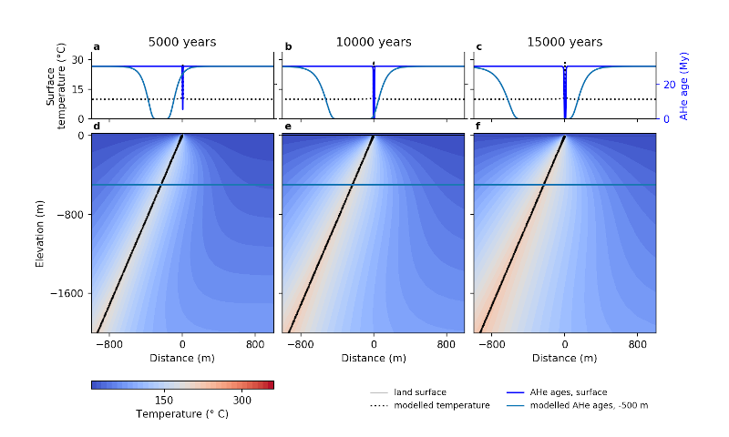

[](https://doi.org/10.5281/zenodo.3359586)


# Beo: Model heat flow and (U-Th)/He thermochronology in a hydrothermal system

*Elco Luijendijk*


# Introduction

Beo is a model of heat flow in hot springs and hydrothermal systems. The model code uses the generic finite element code [esys-escript](https://github.com/esys-escript/esys-escript.github.io) to solve the advective and conductive heat flow equations in a 2D cross-section of the subsurface. The resulting temperature history is used to calculate the apatite (U-Th)/He (AHe) thermochronometer and can be compared to measured AHe ages. Beo supports automated model runs to explore which parameter values like fluid fluxes, fault geometry, age and duration of the hydrothermal activity best match thermochronometer data, spring temperature data or temperature records in nearby boreholes. 

 A description of the model background and two example case studies can be found in the journal Geoscientific Model Development ([Luijendijk 2019](https://doi.org/10.5194/gmd-12-4061-2019)). The model code was used to quantify episodic fluid flow in a fault zone in the Beowawe geyser field in the Basin and Range Province, which was published in a separate paper  in Geology ([Louis et al. 2019](https://pubs.geoscienceworld.org/gsa/geology/article/573168/Episodic-fluid-flow-in-an-active-fault)). In addition the code was used to quantify the history of a hydrothermal system in western Canada ([Jess et al. 2021](https://doi.org/10.1029/2021JF006286))




*Example model run showing modelled temperatures in a simple hydrothermal system with upward fluid flow along a single fault zone. The top panels show the resulting modelled AHe ages at the surface and at 500 m depth.*


# Getting started

* Clone the repository or use the following links to download a zip file of the [model code](https://github.com/ElcoLuijendijk/beo/archive/refs/heads/master.zip).

* Install esys-escript

    - Get the code here: [https://github.com/esys-escript/esys-escript.github.io](https://github.com/esys-escript/esys-escript.github.io)
    - An installation guide can be found here: https://github.com/esys-escript/esys-escript.github.io/blob/master/install.pdf
    - Note that the newer versions of escript support installation using Flatpak or Docker. These install sandboxed versions of esys-escript that currently do not include the Python modules Scipy or Pandas. However, Beo uses these modules for interpolating variables and model-data comparison. Therefore the recommended way to install esys-escript is to use the binary version in Debian/Ubuntu (``sudo apt install python-escript``) or to compile the source code following the intructions in the installation manual.

* Unzip the beo source code 
* Navigate to the directory where you have installed esys-escript and go to the subdirectory ``bin``. If you used apt-get to install esys-escript you can normally find esys-escript in ``/usr/bin/``. Then run Beo by executing the following command from the command line:
	
````bash
./run-escript beo_dir/beo.py
````	

Where ``beo_dir`` is the directory where you have saved Beo.

Alternatively use the command 

````bash
./run-escript -e
````

This will show you three lines that define environment variables that your system needs to be able to find the location of esys-escript. Add these lines to your .bashrc (Ubuntu linux) or profile file in your home directory. After adding these lines and logging out and in again, you can start beo by going to the directory where the beo code is located (so not to the escript/bin directory) and start beo.py like any regular python code:

````bash
python beo.py model_parameters/model_parameters.py
````

where ``model_parameters/model_parameters.py`` is a file containing all model parameters. An example file called ``model_parameters.py`` is located in the directory ``model_parameters``.


# Required modules

Apart from esys-escript Beo requires the Python modules [Numpy](http://www.numpy.org/), [Pandas](https://pandas.pydata.org/), [Scipy](http://scipy.org/scipylib/index.html) and [Matplotlib](http://matplotlib.org/downloads.html).

Note that Beo includes an option to calculate apatite (U-Th)/He ages using the RDAAM model ([Flowers et al. 2009](https://www.sciencedirect.com/science/article/abs/pii/S001670370900043X)). The implementation of the RDAAM model uses a piece of Fortran code to speed up the model. To enable the RDAAM model you first need to compile the Fortran code using f2py, which is normally included with Numpy. See this [link](https://docs.scipy.org/doc/numpy/f2py/) for more information on f2py. To install the Fortran RDAAM module, navigate to the subdirectory lib and run the following command:

``f2py -c calculate_reduced_AFT_lengths.f90 -m calculate_reduced_AFT_lengths``

If all goes well there should now be a file called ``calculate_reduced_AFT_lengths.so`` in the subdirectory lib, which will be used by Beo to calculate radiation damage and the diffusivity of helium in apatites. Currently new updates are planned to convert the fortran code to python, which will remove this requirement.

Note that there are plans to port the fortran code to cPython to avoid this extra compilation step. Feel free to bug me if you have trouble compiling this or if you are interested in a Python only version. 

Beo was tested on Ubuntu 14.04, 16.04, 18.04 and 22.04, with escript versions up to 5.10 


# Manual and publication

You can find a manual for beo in the subdirectory [manual](manual). The manual contains more background on the model, an explanation of how surface heat flow is modeled and a detailed list and explanation of the model parameters. More information on the model code can be found in [Luijendijk (2019)](https://doi.org/10.5194/gmd-12-4061-2019). See the bottom of this readme for the full reference for this paper. 

The paper shows model results for two example case studies: the Baden & Schinznach hot springs at the boundary of the Molasse Basin and the Jura, and the Brigerbad hot springs in the Rhone Valley in the Swiss Alps. These model runs can be reproduced by using one of the parameter files located in the directory [example_input_files](example_input_files).


# Model input & output

## Model input:

All model input parameters are contained in a single Python file. An example file can be found in [model_parameters.py](model_parameters/model_parameters.py) located in the directory [model_parameters](model_parameters). The class ``ModelParameters`` contains all parameters needed for a single model run. See the [manual](manual\beo_manual.pdf) for an explanation of the model parameters. There are a number of example input files that can be used to reproduce the results shown in the [GMD paper](https://doi.org/10.5194/gmd-12-4061-2019) in the directory [example_input_files](example_input_files).


## Multiple model runs

Optionally you can start automated runs to test a range of parameter combinations. This is useful for automated sensitivity or uncertainty analysis. 

The model input file contains a class called ``ParameterRanges``. Any parameter value that is included in this class will be used as input for a single model run. All results will be stored and written to a comma separated (.csv) file names ``model_output/model_params_and_results_x_runs.csv``. 

You can include any model parameter in the automated runs. Simply copy a parameter from the ``ModelParameters`` class into the ``ParameterRanges`` class and add _s to the parameter name. For instance to test multiple values of the thermal gradient, add `thermal_gradient_s = [0.03, 0.04, 0.05]` to test the effect of geothermal gradients of 0.03, 0.04 and 0.05 C/m, respectively.

There are two options for running multiple model runs. The default is a sensitivity run. In each model run a single parameter will be changed, while all other parameters are kept constant at the default value specified in the ``ModelParameters`` class. Alternatively you can test all parameter combinations by changing `parameter_combinations = False` to `parameter_combinations = True`. Note that this will generate a lot of model runs, testing ten parameter values for two parameters each will generate 10*10 = 100 model runs, for three parameters this increase to a 1000 model runs, etc...


## Model output

* After each model run, the modeled temperature field and (U-Th)/He data are stored in the directory ``model_output`` as a .pck file, which can be read using Python's pickle module and which can be used by the script [make_figures.py](make_figures.py) to make figures. 
* Beo saves a comma separated file containing the input parameters and a summary of the results for each model run and each timestep in the same directory.
* Beo also contains an option to save modeled temperature and advective flux to a VTK file, which can be used for visualization using software such as Paraview and Visit.


## Making figures

The script [make_figures.py](make_figures.py) will make a single figure of the final temperature field for output files (with extension .pck) found in the directory ``model_output``. After running this script you will be prompted to select the output file that you would like a figure of. The file [model_parameters/figure_params.py](model_parameters/figure_params.py) contains a number of parameters that control the figure, such as which timeslices to show, the min. and max. coordinates of the area to show, etc.. The resulting figure is saved as a .png file in the same directory as the model output file.


# License

Beo is distributed under the GNU General Public License, version 3:
http://www.gnu.org/copyleft/gpl.html

A copy of this license is distributed along with the source code, see LICENSE.txt


# Reference

Please cite the following paper if you publish work that uses Beo:

Luijendijk, E. (2019) Beo v1.0: Numerical model of heat flow and low-temperature thermochronology in hydrothermal systems, Geoscientific Model Development 12 (9): 4061-4073, [https://doi.org/10.5194/gmd-12-4061-2019](https://doi.org/10.5194/gmd-12-4061-2019). 

The code has also been published at Zenodo:

Elco Luijendijk (2019). Beo: Numerical model of heat flow and low-temperature thermochronology in hydrothermal systems. Zenodo. [http://doi.org/10.5281/zenodo.3359586](http://doi.org/10.5281/zenodo.3359586)

[](https://doi.org/10.5281/zenodo.3359586)

