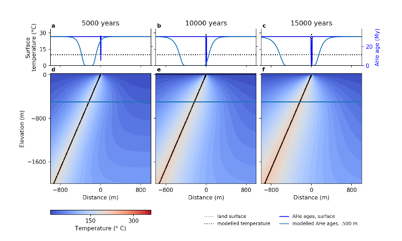

[](https://doi.org/10.5281/zenodo.3359586)


# Beo: Model heat flow and (U-Th)/He thermochronology in a hydrothermal system

*Elco Luijendijk*


# Introduction

Beo is a model of heat flow in hot springs and hydrothermal systems. The model code uses the generic finite element code [esys-escript](https://github.com/esys-escript/esys-escript.github.io) to solve the advective and conductive heat flow equations in a 2D cross-section of the subsurface. The resulting temperature history is used to calculate the apatite (U-Th)/He (AHe) thermochronometer and can be compared to measured AHe ages. Beo supports automated model runs to explore which parameter values like fluid fluxes, fault geometry, age and duration of the hydrothermal activity best match thermochronometer data, spring temperature data or temperature records in nearby boreholes. 

 A description of the model background and two example case studies can be found in the journal Geoscientific Model Development ([Luijendijk 2019](https://doi.org/10.5194/gmd-12-4061-2019)). The model code was used to quantify episodic fluid flow in a fault zone in the Beowawe geyser field in the Basin and Range Province, which was published in a separate paper  in Geology ([Louis et al. 2019](https://pubs.geoscienceworld.org/gsa/geology/article/573168/Episodic-fluid-flow-in-an-active-fault)). In addition the code was used to quantify the history of a hydrothermal system in western Canada ([Jess et al. 2021](https://doi.org/10.1029/2021JF006286))




*Example model run showing modelled temperatures in a simple hydrothermal system with upward fluid flow along a single fault zone. The top panels show the resulting modelled AHe ages at the surface and at 500 m depth.*


# Getting started

Beo is run directly from the directory that contains the source code, it is not installed as a Python package. Getting started therefore means downloading the code and installing the Python modules that it needs.

* Clone the repository or use the following link to download a zip file of the [model code](https://github.com/ElcoLuijendijk/beo/archive/refs/heads/master.zip) and unzip it.

* Install the Python modules that Beo needs, either with conda or with pip. See the installation section below.

* Run Beo from the directory that contains the source code:

````bash
python beo.py model_parameters/model_parameters.py
````

where ``model_parameters/model_parameters.py`` is a file containing all model parameters. An example file called ``model_parameters.py`` is located in the directory ``model_parameters``.


# Installation

Beo can solve the heat flow equation with two different numerical backends, esys-escript and fipy. Which modules you need depends on which backend you want to use. See the section on numerical backends below for the differences between the two.

The fipy backend can be installed with conda or pip and works on Linux, macOS and Windows. esys-escript is not available on conda-forge or PyPI and needs to be installed separately, see below.

Python 3.10 or higher is required for the fipy backend. On Python 3.8 and 3.9 fipy installs but fails to import, because it does not pull in the ``importlib_metadata`` module that it needs on those versions of Python.

## Installation with conda

The file ``environment.yml`` contains all modules needed to run Beo with the fipy backend:

````bash
conda env create -f environment.yml
conda activate beo
````

Alternatively install the modules into an existing environment:

````bash
conda install -c conda-forge numpy scipy pandas matplotlib fipy python-gmsh pytest
````

Note that the conda package that contains the gmsh Python module is called ``python-gmsh`` and not ``gmsh``. The package ``gmsh`` only contains the gmsh executable. Installing ``python-gmsh`` also installs the executable, which fipy needs to read mesh files.

## Installation with pip

The file ``requirements.txt`` contains the same set of modules:

````bash
pip install -r requirements.txt
````

or install them directly:

````bash
pip install numpy scipy pandas matplotlib "fipy>=4.0" gmsh pytest
````

Unlike the conda package, the ``gmsh`` package on PyPI contains both the Python module and the gmsh executable, so no separate package is needed.

## Checking the installation

Run the following commands from the directory that contains the Beo source code. First check that the fipy backend and all of its dependencies were found:

````bash
python -c "import lib.beo_fipy; print(lib.beo_fipy.check_fipy_available())"
````

This should print ``True``. Then run the tests of the fipy backend:

````bash
python -m pytest tests/test_fipy_backend.py
````

These compare the model with analytical solutions for conductive and for advective and conductive heat flow. Note that the tests are skipped rather than failed if fipy is missing, so check the output for ``passed`` and not for ``skipped``.

Finally, run one of the example models:

````bash
python beo.py model_parameters/model_parameters.py
````

with ``backend = 'fipy'`` set in the model parameter file.

## Installing esys-escript

esys-escript is only needed if you want to use the escript backend, which is the default. It is not available on conda-forge or PyPI.

- Get the code here: [https://github.com/esys-escript/esys-escript.github.io](https://github.com/esys-escript/esys-escript.github.io)
- An installation guide can be found here: https://github.com/esys-escript/esys-escript.github.io/blob/master/install.pdf
- Note that the newer versions of escript support installation using Flatpak or Docker. These install sandboxed versions of esys-escript that currently do not include the Python modules Scipy or Pandas. However, Beo uses these modules for interpolating variables and model-data comparison. Therefore the recommended way to install esys-escript is to use the binary version in Debian/Ubuntu (``sudo apt install python-escript``) or to compile the source code following the intructions in the installation manual.

After installing esys-escript, navigate to the directory where you have installed it and go to the subdirectory ``bin``. If you used apt-get to install esys-escript you can normally find esys-escript in ``/usr/bin/``. Then run Beo by executing the following command from the command line:

````bash
./run-escript beo_dir/beo.py
````	

Where ``beo_dir`` is the directory where you have saved Beo.

Alternatively use the command 

````bash
./run-escript -e
````

This will show you three lines that define environment variables that your system needs to be able to find the location of esys-escript. Add these lines to your .bashrc (Ubuntu linux) or profile file in your home directory. After adding these lines and logging out and in again, you can start beo by going to the directory where the beo code is located (so not to the escript/bin directory) and start beo.py like any regular python code.


# Required modules

Beo requires the Python modules [Numpy](http://www.numpy.org/), [Pandas](https://pandas.pydata.org/), [Scipy](http://scipy.org/scipylib/index.html) and [Matplotlib](http://matplotlib.org/downloads.html), plus one of the two numerical backends. The escript backend needs esys-escript, the fipy backend needs the Python modules [fipy](https://www.ctcms.nist.gov/fipy/) and [gmsh](https://gmsh.info/).

Note that Beo includes an option to calculate apatite (U-Th)/He ages using the RDAAM model ([Flowers et al. 2009](https://www.sciencedirect.com/science/article/abs/pii/S001670370900043X)). The implementation of the RDAAM model uses a piece of Fortran code to speed up the model. To enable the RDAAM model you first need to compile the Fortran code using f2py, which is normally included with Numpy. See this [link](https://docs.scipy.org/doc/numpy/f2py/) for more information on f2py. To install the Fortran RDAAM module, navigate to the subdirectory lib and run the following command:

``f2py -c calculate_reduced_AFT_lengths.f90 -m calculate_reduced_AFT_lengths``

If all goes well there should now be a file called ``calculate_reduced_AFT_lengths.so`` in the subdirectory lib, which will be used by Beo to calculate radiation damage and the diffusivity of helium in apatites. Currently new updates are planned to convert the fortran code to python, which will remove this requirement.

Note that there are plans to port the fortran code to cPython to avoid this extra compilation step. Feel free to bug me if you have trouble compiling this or if you are interested in a Python only version. 

Beo was tested on Ubuntu 14.04, 16.04, 18.04 and 22.04, with escript versions up to 5.10. The fipy backend was tested on macOS with Python 3.10 and 3.12, fipy 4.0 and gmsh 4.15, installed with both conda and pip.


# Numerical backends

Beo can solve the heat advection and conduction equation with two different numerical backends. The default backend uses the finite element code esys-escript. As an alternative there is a backend that uses the finite volume code [fipy](https://www.ctcms.nist.gov/fipy/), which does not require escript to be installed and can therefore be used on platforms where escript is not available, such as macOS and Windows.

Select the backend with the parameter ``backend`` in the model parameter file:

````python
backend = 'escript'
````

or

````python
backend = 'fipy'
````

The fipy backend requires the Python modules [fipy](https://www.ctcms.nist.gov/fipy/) and [gmsh](https://gmsh.info/), see the installation section above.

The fipy backend generates the same model geometry as the escript backend, using the gmsh Python module instead of the meshing tools that are included with escript. The mesh contains horizontal lines at each of the elevations in the parameter ``target_zs``, which are used to gradually lower the land surface and simulate exhumation. The model output is identical to the output of the escript backend, so the same figures and thermochronometer calculations can be used for both backends.

Two differences between the backends are worth keeping in mind.

First, fipy calculates temperatures at the center of each grid cell instead of at the nodes of the mesh. Beo interpolates these temperatures to the nodes of the mesh with a least squares fit, so that temperatures are available at the exact elevations in ``target_zs``.

Second, fipy uses a two point flux approximation for the conductive heat flux, which is less accurate than the finite element method of escript on the triangular and locally refined meshes that Beo uses. A purely conductive model with the cell sizes in the example file ``model_parameters/model_parameters.py`` was compared with the analytical solution for a linear geotherm. The mean error over the whole model domain is 0.44 degrees C. In the upper kilometre of the model domain, where the hydrothermal system and the thermochronometer samples are located, the mean error is 0.13 and the maximum error 0.61 degrees C. The largest errors of up to 8.9 degrees C occur near the base of the model domain, where the cells are coarsest. Reducing ``cellsize`` and ``cellsize_base`` from 500 and 1000 m to 250 m lowers the mean error to 0.12 and the maximum error at depth to 1.8 degrees C. Reduce these parameters if higher accuracy at depth is needed.

Note that saving model results to VTK files is currently only supported for the escript backend.

The discretization of the advection term for the fipy backend can be changed with the parameter ``fipy_convection_scheme``, which can be set to ``powerlaw``, ``exponential``, ``upwind`` or ``central``. The default is ``powerlaw``.


# Radially symmetric models

The fipy backend can also solve the heat flow equation assuming radial symmetry around a vertical axis, instead of a cartesian cross section. This is useful for modeling a single hot spring conduit, where the heat flows outward in all directions instead of only in the two directions of a cross section. Switch this on with:

````python
radial_symmetry = True
````

An example input file is included as ``model_parameters/model_parameters_radial.py``. It is a submarine hydrothermal vent, with a single vertical conduit with a radius of 0.15 m that reaches a depth of 470 m and discharges 35 litres of water per second. A horizontal aquifer at the base of the conduit feeds the conduit with the same flow. The layer above the seafloor is seawater at 8 degrees C that only conducts heat, so ``variable_K_air`` is set to False and ``K_air`` is the thermal conductivity of seawater. The geothermal gradient of 30 degrees C per km is imposed with a specified heat flux at the base of the model domain.

By default an aquifer is assumed to drain the fault, so Beo switches off the flow in the fault above the aquifer. Set ``aquifer_cuts_off_fault = False`` if the aquifer feeds the fault instead, as it does in this example. Without this the flow in the conduit above the aquifer is removed and there is no vent at all.

The size of the model domain of this example was chosen using the analytical solution for lateral conductive heat flow. The conductive diffusion front erfc(r / (2 sqrt(kappa t))) drops below 0.1 percent at a radius of 2505 m after 15000 years, and the modeled temperature increase is much smaller than that beyond a radius of about 1000 m, because the water needs less than half an hour to travel up the conduit and carries almost all of its heat into the seawater instead of releasing it into the rock. The domain of the example is larger than that, with a radius of 4000 m, because the heat carried by the vent is the entire conductive heat flow of a region with a radius of about 3.2 km, so the domain at least spans the region that would have to supply the heat. Note that the required domain size depends strongly on how long the vent has been active. For a vent that has only been active for a century the conductive front reaches about 200 m and a radius of 1000 to 1500 m is more than enough.

The example also contains a sweep over the depth of the fault in the ``ParameterRanges`` class at the bottom of the file, which is used to find the fault depth that reproduces a measured outlet temperature at the vent. Beo runs one model for each value in ``fault_bottoms_s`` and writes the results of each run to the model output directory.

An important limitation applies to any model with a prescribed fluid flux, which includes both backends of Beo. Beo does not solve for the flow, it prescribes it, and it writes the advection term as q . grad T. The prescribed flux is not divergence free, water appears where the flux switches on at the base of the fault and disappears where it switches off at the land surface or the seafloor. Integrating the advection term over the model domain then gives a net heat input of rho_f c_f Q (T_in - T_out), which is exactly the heat that the spring or vent discharges. The model therefore creates the heat that it discharges and cannot be used to test whether the heat supply is large enough to sustain the flow. That question has to be answered separately, with a heat balance calculation. Changing the boundary condition at the base of the model from a specified temperature to a specified heat flux does not change this.

The model domain is then a vertical section from the symmetry axis at r = 0 to an outer radius, and the parameter ``width`` is the outer radius of the model domain. The fault is a cylindrical conduit centered on the symmetry axis with a radius of half the fault width, so that a fault width of 50 m gives a conduit with a radius of 25 m.

A radially symmetric model requires a single vertical fault located on the symmetry axis and horizontal aquifers, anything else does not describe a body of rotation. So ``fault_xs`` has to be ``[0.0]``, ``fault_angles`` has to be ``[90.0]`` and the aquifer angles have to be zero. Beo checks this and stops with an error message if the model parameters describe something else.

The units of the fluid fluxes change for a radially symmetric model. Instead of m2/sec they are specified in m3/sec, which is the total volume of water flowing through the fault or the aquifer. For the fault this total flow is spread evenly over the cross section of the conduit, so the darcy flux is the flow divided by pi r^2. For an aquifer the flow crosses a cylinder that grows with the distance from the axis, so the flux is the flow divided by the circumference at that radius times the aquifer thickness, which means the flux decreases with the distance from the fault.

Two things are worth knowing about how this is implemented. First, multiplying the axisymmetric heat flow equation by the radius turns it into an ordinary two dimensional equation in which all coefficients are weighted by the radius, so the same solver and the same unstructured mesh can be used. Second, this weighting makes the terms of the equation much larger far away from the symmetry axis than close to it. Newer versions of fipy decide that the equation has converged by comparing the residual with the norm of the right hand side, which for a radially symmetric model is dominated by the cells far away from the axis. Beo therefore explicitly asks fipy to base convergence on the reduction of the initial residual instead. Without this fipy silently returns the temperatures of the previous timestep and the model shows no heating at all.

Radially symmetric models are only supported by the fipy backend, the escript backend always solves a cartesian cross section.


# Manual and publication

You can find a manual for beo in the subdirectory [manual](manual). The manual contains more background on the model, an explanation of how surface heat flow is modeled and a detailed list and explanation of the model parameters. More information on the model code can be found in [Luijendijk (2019)](https://doi.org/10.5194/gmd-12-4061-2019). See the bottom of this readme for the full reference for this paper. 

The paper shows model results for two example case studies: the Baden & Schinznach hot springs at the boundary of the Molasse Basin and the Jura, and the Brigerbad hot springs in the Rhone Valley in the Swiss Alps. These model runs can be reproduced by using one of the parameter files located in the directory [example_input_files](example_input_files).


# Model input & output

## Model input:

All model input parameters are contained in a single Python file. An example file can be found in [model_parameters.py](model_parameters/model_parameters.py) located in the directory [model_parameters](model_parameters). The class ``ModelParameters`` contains all parameters needed for a single model run. See the [manual](manual\beo_manual.pdf) for an explanation of the model parameters. There are a number of example input files that can be used to reproduce the results shown in the [GMD paper](https://doi.org/10.5194/gmd-12-4061-2019) in the directory [example_input_files](example_input_files).


## Multiple model runs

Optionally you can start automated runs to test a range of parameter combinations. This is useful for automated sensitivity or uncertainty analysis. 

The model input file contains a class called ``ParameterRanges``. Any parameter value that is included in this class will be used as input for a single model run. All results will be stored and written to a comma separated (.csv) file names ``model_output/model_params_and_results_x_runs.csv``. 

You can include any model parameter in the automated runs. Simply copy a parameter from the ``ModelParameters`` class into the ``ParameterRanges`` class and add _s to the parameter name. For instance to test multiple values of the thermal gradient, add `thermal_gradient_s = [0.03, 0.04, 0.05]` to test the effect of geothermal gradients of 0.03, 0.04 and 0.05 C/m, respectively.

There are two options for running multiple model runs. The default is a sensitivity run. In each model run a single parameter will be changed, while all other parameters are kept constant at the default value specified in the ``ModelParameters`` class. Alternatively you can test all parameter combinations by changing `parameter_combinations = False` to `parameter_combinations = True`. Note that this will generate a lot of model runs, testing ten parameter values for two parameters each will generate 10*10 = 100 model runs, for three parameters this increase to a 1000 model runs, etc...


## Model output

* After each model run, the modeled temperature field and (U-Th)/He data are stored in the directory ``model_output`` as a .pck file, which can be read using Python's pickle module and which can be used by the script [make_figures.py](make_figures.py) to make figures. 
* Beo saves a comma separated file containing the input parameters and a summary of the results for each model run and each timestep in the same directory.
* Beo also contains an option to save modeled temperature and advective flux to a VTK file, which can be used for visualization using software such as Paraview and Visit.


## Making figures

The script [make_figures.py](make_figures.py) will make a single figure of the final temperature field for output files (with extension .pck) found in the directory ``model_output``. After running this script you will be prompted to select the output file that you would like a figure of. The file [model_parameters/figure_params.py](model_parameters/figure_params.py) contains a number of parameters that control the figure, such as which timeslices to show, the min. and max. coordinates of the area to show, etc.. The resulting figure is saved as a .png file in the same directory as the model output file.


# License

Beo is distributed under the GNU General Public License, version 3:
http://www.gnu.org/copyleft/gpl.html

A copy of this license is distributed along with the source code, see LICENSE.txt


# Reference

Please cite the following paper if you publish work that uses Beo:

Luijendijk, E. (2019) Beo v1.0: Numerical model of heat flow and low-temperature thermochronology in hydrothermal systems, Geoscientific Model Development 12 (9): 4061-4073, [https://doi.org/10.5194/gmd-12-4061-2019](https://doi.org/10.5194/gmd-12-4061-2019). 

The code has also been published at Zenodo:

Elco Luijendijk (2019). Beo: Numerical model of heat flow and low-temperature thermochronology in hydrothermal systems. Zenodo. [http://doi.org/10.5281/zenodo.3359586](http://doi.org/10.5281/zenodo.3359586)

[](https://doi.org/10.5281/zenodo.3359586)

